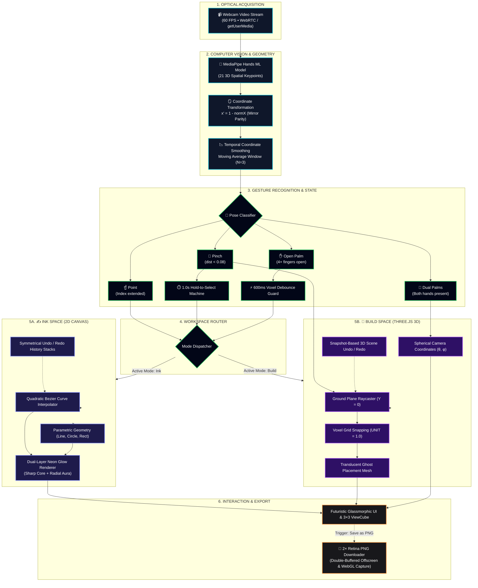

<div align="center">

# ✦ AirForge Studio
### *Next-Gen Spatial Computing & Gesture-Controlled Workspace*

**Draw in 2D luminous ink and construct 3D voxel worlds using only your webcam and hands.**

[](https://threejs.org/)
[](https://developer.mozilla.org/en-US/docs/Web/API/Canvas_API)
[](https://developers.google.com/mediapipe)
[](https://developer.mozilla.org/en-US/docs/Web/JavaScript)
[](https://vitejs.dev/)
[](./LICENSE)

[](https://air-forge.vercel.app/)

[Why AirForge?](#why-airforge) • [Key Highlights](#highlights) • [Interactive Spaces](#spaces) • [Gesture Matrix](#gestures) • [Architecture](#architecture) • [Quickstart](#quickstart) • [Export Pipeline](#export)

</div>

---

<a id="why-airforge"></a>
## 🎯 Why AirForge?

Most spatial computing experiences today require **$500–$3,500 VR headsets** or specialized hardware accessories. AirForge was built on a simple premise: **spatial interaction should be accessible to anyone with a browser and a webcam.**

* 🖐️ **Intuitive Spatial Creation** — Manipulating 3D objects with a 2D mouse is unintuitive. AirForge bridges physical intuition and digital space by turning natural hand gestures into direct creative inputs.
* ⚡ **Frictionless Onboarding** — No app downloads, no drivers, and zero installation. Open a URL, allow camera access, and start building in under 5 seconds.
* 🔒 **100% Private by Design** — All MediaPipe vision inference and WebGL rendering execute entirely on-device via WebAssembly. No video streams or frame data ever leave your machine.
* 🎓 **Real-World Applications** — Built for rapid 3D voxel prototyping, touchless live presentations, interactive education, and sterile/touch-free computing environments.

---

<a id="highlights"></a>
## 🌟 Key Highlights

> **⚡ Zero-Install Spatial Engine**  
> Runs natively in modern browsers via WebRTC & WebGL. Zero external sensors, drivers, or software installation required.
>
> **🪞 Mirror Parity Calibration**  
> Mathematical screen-space inversion ($x' = 1 - x$) ensures physical hand motion matches on-screen interaction with zero cognitive delay.
>
> **🌌 Neon Glassmorphism Shell**  
> Deep obsidian `#020617` workspace with contextual state-driven neon glow feedback and an electric cyan-white (`#7df9ff`) precision slider.
>
> **🛡️ Deterministic Input Guard**  
> Symmetrical undo/redo stacks & a 600ms debounce guard eliminate phantom inputs and accidental voxel duplication.

---

<a id="spaces"></a>
## 🔀 Interactive Spaces

### ✍️ Ink Space · *2D Precision Sketching*
> **Air-Pen Clutch** ── Pinch to write and release to lift pen cleanly, eliminating stray connecting lines  
> **Smart Script Beautifier** ── Automatically smooths and beautifies shaky air-writing with Chaikin subdivision  
> **Neon Typography** ── Instantly place glowing, crisp vector text (e.g. your name) directly on canvas  
> **Parametric Shapes** ── Seamlessly create straight lines, perfect circles, and 4-corner rectangles  
> **Pinch-to-Move** ── Drag and reposition any stroke or text anywhere with physical gesture kinetics  
> **Canvas Guides** ── Switch between Blank, Lined, Grid, and Dotted backgrounds with isolated Undo/Redo history  

---

### 🧊 Build Space · *3D Spatial Architecture*
> **Ground-Plane Snapping** ── Real-time raycasting against $Y = 0$ ground plane for seamless voxel alignment  
> **Ghost Block Preview** ── Translucent wireframe ghost preview gives instant spatial depth feedback  
> **Two-Hand 360° Orbit** ── Spread both palms to fluidly orbit the 3D camera around your creation  
> **Interactive 3D ViewCube** ── Click any face, edge, or corner of the 3D gizmo to snap to standard CAD orthographic views  
> **Precision Mouse Zoom** ── Smooth wheel-driven zoom smoothly scales camera radius without losing orbit focus  

---

<a id="gestures"></a>
## 🤲 Gesture Interaction Matrix

AirForge uses an intuitive gesture recognition engine designed for zero false triggers:

| Gesture | How to Perform | What It Does |
| :---: | :--- | :--- |
| **🤏 Air-Pen Pinch** | Thumb & index fingertips together | **Write / Draw** cleanly *(Ink Space)* • **Preview** 3D voxel *(Build Space)* |
| **☝️ Point (Hover)** | Index extended, thumb apart | **Aim cursor** with glowing reticle • **Laser draw** *(when in Laser mode)* |
| **✋ Open Palm** | 4+ fingers spread open | **Commit** voxel • **Release** held stroke • **Stop** drawing |
| **🤲 Two Palms** | Both hands open in camera view | **Orbit** 3D camera 360° around scene origin *(Build Space)* |
| **🖱️ Scroll Wheel** | Mouse wheel vertical scroll | **Zoom** in / out smoothly *(Build Space)* |

---

<a id="architecture"></a>
## 🏗️ System Architecture

The following diagram illustrates the complete, deterministic pipeline from raw camera frames to real-time spatial interaction and high-resolution output:



---

<a id="quickstart"></a>
## 🚀 Quickstart

### Prerequisites
* A Chromium-based browser (**Google Chrome** or **Microsoft Edge** recommended for optimal WebGL performance).
* A standard webcam (internal or external).

### 1. Clone the Repository
```bash
git clone https://github.com/SumanthMamidi-MNS/AirForge.git
cd AirForge
```

### 2. Install Dependencies
```bash
npm install
```

### 3. Launch Development Server
```bash
npm run dev
```
Navigate to `http://localhost:3000`. Grant webcam access when prompted.

### 4. Build for Production
```bash
npm run build
npm run preview
```

> 🔒 **Security Notice**: Modern browsers require an **HTTPS** connection (or `localhost`) to access the `getUserMedia` webcam API.

---

<a id="export"></a>
## 📸 High-Resolution (2×) Export

AirForge includes a production-grade export pipeline that captures your creations without canvas tearing or downsampling:

* **2D Ink Canvas Export**: Uses an offscreen double-dimensioned buffer (`width × 2`, `height × 2`) to bake crisp anti-aliased neon strokes over a pure `#0a0a0a` background.
* **3D Build Scene Export**: Temporarily raises Three.js `setPixelRatio(Math.max(2, window.devicePixelRatio))` with `preserveDrawingBuffer: true`, forces a single render pass, and outputs directly to a downloadable PNG.
* **Standardized Filename Format**:
  * `Airforge_Ink_YYYY-MM-DD.png`
  * `Airforge_Build_YYYY-MM-DD.png`

---

## 📁 Repository Directory Structure

```
airforge/
├── index.html                  # Application layout, glassmorphic styles & MediaPipe CDN
├── vite.config.js              # Vite server & bundler configuration
├── package.json                # Project dependencies, metadata & scripts
├── LICENSE                     # MIT License
├── README.md                   # Project documentation & interaction guides
└── src/
    ├── main.js                 # Core loop, MediaPipe results hook & mode coordinator
    ├── camera.js               # Camera stream acquisition & initialization
    ├── constants.js            # Neon palettes, landmark IDs & gesture thresholds
    ├── gestures/
    │   ├── detector.js         # 5-gesture classifier (Point, Pinch, Palm, Idle)
    │   └── landmarks.js        # Vector calculations, Euclidean distance & pinch detection
    ├── ink/
    │   ├── inkCanvas.js        # 2D Canvas manager, coordinate mapping & 2× PNG export
    │   ├── strokes.js          # Stroke data structure with clean Undo/Redo stacks
    │   ├── neon.js             # Dual-layer neon glow renderer (blur aura + sharp core)
    │   ├── shapes.js           # Line, Circle, and 4-corner Rectangle parametric math
    │   ├── gestureHandler.js   # 2D gesture state machine (Draw, 1s Hold Select, Drag)
    │   └── background.js       # Background templates (Blank, Lined, Grid, Dotted)
    ├── build/
    │   ├── buildScene.js       # Three.js setup, top-down isometric view & screenshot
    │   ├── buildGestureHandler.js # 3D gesture handler with 600ms placement debounce
    │   ├── blocks.js           # Voxel cube manager with snapshot-based 3D Undo/Redo
    │   ├── grid.js             # 3D spatial floor grid
    │   ├── preview.js          # Translucent ghost block preview
    │   ├── viewcube.js         # 3×3 camera viewpoint matrix panel with smooth easing
    │   ├── gizmo.js            # Visual transformation indicator for active block
    │   └── orbit.js            # Two-hand spherical coordinate camera orbit controller
    └── ui/
        ├── sidebar.js          # Glassmorphic sidebar actions, sliders & color swatches
        ├── helpModal.js        # Modal guide detailing gesture interactions
        ├── onboarding.js       # First-visit tutorial welcome card
        ├── statusBar.js        # Real-time hand detection status indicator
        └── simpleMode.js       # Minimal UI toggle for distraction-free creation
```

---

## 🛠️ Technology Stack

| Component | Technology | Purpose |
|---|---|---|
| **Computer Vision** | [MediaPipe Hands](https://developers.google.com/mediapipe) | 21 3D hand landmark tracking at 60 FPS |
| **3D Rendering** | [Three.js (r184)](https://threejs.org/) | Voxel construction, raycasting & spherical orbit camera |
| **2D Rendering** | [HTML5 Canvas 2D](https://developer.mozilla.org/en-US/docs/Web/API/CanvasRenderingContext2D) | Dual-layer neon glow drawing and stroke selection |
| **Bundler & Tooling** | [Vite 8](https://vitejs.dev/) | Hot Module Replacement (HMR) & ES module bundling |
| **UI Aesthetics** | [CSS Glassmorphism](https://developer.mozilla.org/en-US/docs/Web/CSS/backdrop-filter) | Backdrop filters, layered neon glow, responsive sidebar |

---

## 📄 License

Distributed under the **MIT License**. See [`LICENSE`](./LICENSE) for details.

---

<div align="center">

Designed & Developed by **[Sumanth Mamidi](https://github.com/SumanthMamidi-MNS)**

<sub>Copyright © 2026 Sumanth Mamidi</sub>

</div>
